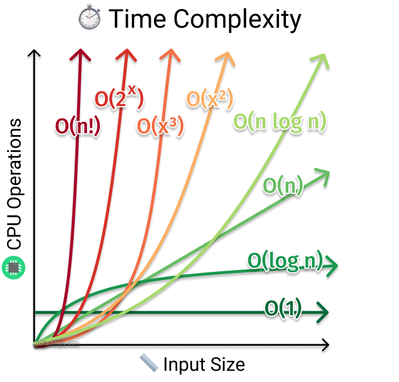

# Time Complexity

> This lesson would have been very helpful when I went through this in college...

## Asymptotic Notations

- Describes the running time of an algorithm
- How the algorithm performs as the input changes / scales in size
- **Relative to the input!**
  - It asks the question, _"When the input changes, how does the algorithm performance change?"_

### Big-Θ (Theta)

- Upper and lower bound
- Average performance
- Does not appear as often in discussions

### Big-Ω (Omega)

- Lower bound
- Performance in the best case
- Not as useful because best case scenarios are rare
- A non-performant algorithm in the best case is surely non-performant in the worst case as well

### Big-O

- Upper bound
- Performance in the worst case
- Almost synonymous with "_Time Complexity_"
- Worst case scenario should be optimized as much as possible

**Common Big-O notations:**

> It helps to plot the "math expressions" in a graph to get a sense of how the time complexity grows and how each notations compare with each other

#### `O(1)` Constant time

- _"No matter how big the input is, the algorithm will always finish after the same time period"_
- Does not necessarily mean that it will finish _fast_, only that it will finish _consistently_ at the same duration
  - Most constant-time algorithms are fast though
- Examples
  - Array accesses (_provided it is properly implemented by the language_)

#### `O(log N)` Logarithmic time

> The second best to Constant Time

> A reasonable goal to strive for

- Takes one more "step" as the input doubles in size
- Examples:
  - Binary search

#### `O(N)` Linear time

- As the input grows, the performance also slows down as well, in a 1:1 manner
- A lot of algorithms are in Linear Time
- Examples
  - Iteration
  - Loops

#### `O(N log N)`

- _A bit worst than Linear Time, but much better than Quadratic Time_
- Usually a "nested" algorithm, e.g. where an outer algorithm is `O(log N)`, but each "output" is further processed by an `O(N)` algorithm
- Examples:
  - Merge sort
  - Cartesian tree

#### `O(n²)` Quadratic time

- Slow!
- Kind of frowned upon
- A lot of inefficient algorithms are start at quadratic time
- Examples:
  - Nested loops

#### `O(n³)` Cubic time

- Incredibly slow!
- Examples:
  - Nested loops

#### `O(2ⁿ)` Exponential time

- As the input increases, the steps double
- Inverse with Logarithmic time
  - Exponentials and Logarithms have an inverse relationship!

#### `O(N!)` Factorial time

- VERY VERY SLOW
- Examples:
  - Permutations
  - Combinations
  - Combinatorics
