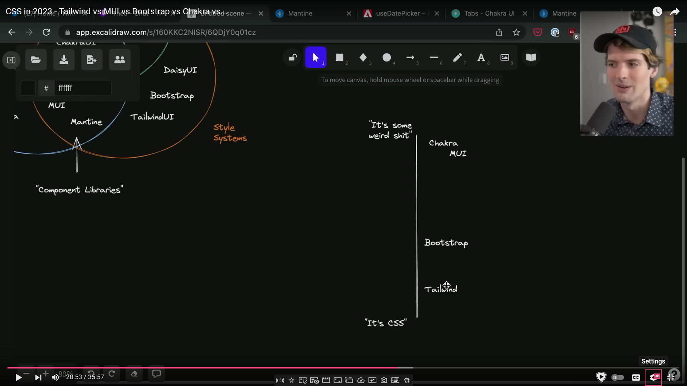

# Styling React Applications

> Tailwind!!!

[Helpful diagram of CSS solutions by Theo Browne](https://www.youtube.com/watch?v=CQuTF-bkOgc)

<!--  -->
<!--  -->

## CSS++

### CSS Modules

- Import CSS files as an object
- Object keys are class names (that you wrote)
- Object values are new automatically generated class names
  - Generated names use the rules/properties you wrote, but scoped (via `:has()`?)
  - Only used by the element on which you specified the class

### Utility libraries

- Tailwind
- [Bootstrap (utilities)](https://getbootstrap.com/docs/5.3/utilities/api/)

### CSS Preprocessors

Kind of like an almost-programming language but for writing CSS

- SASS (SCSS)
- LESS
- Stylus
- PostCSS
  - Also used by Vite
  - More like a plugin system that extends CSS that you write
  - Others let you write CSS in a different way
  - Faster alternative(?): Lightning CSS

## CSS-in-JS

> I'd argue utility libraries also fall under this, when writing markup in JS (e.g. JSX)

### Styled Components

- Creates a bare custom component with styles
- You write the styles, inside JS

## Component libraries

- Chakra UI
- Radix
- Material UI

### Copy-Paste libraries

- [`shadcn`](https://ui.shadcn.com/docs)
  - Built on top of Radix
- [Tailwind UI](https://tailwindui.com/)
  - Regular HTML elements with premade Tailwind classes
  - Possible Headless UI dependency for behaviors

### Build one yourself!

Create components that map to a single element, but with your desired customizations

- Tailwind

  ```jsx
  function SolidButton({ text, onClick }) {
    const classes = [
      "px-4 py-3 rounded-full",
      "bg-blue-600 text-white",
      "font-bold uppercase tracking-widest text-sm",
      "transition hover:brightness-90 active:scale-90 active:brightness-75",
    ].join(" ");
    return (
      <button className={classes} onClick={onClick}>
        {text}
      </button>
    );
  }
  ```

- CSS Modules

  ```css
  /* solid-button.module.css */

  .solid-button {
    padding: 0.75rem 1rem;
    border-radius: 9999px;

    background-color: blue;
    color: white;

    font-weight: 700;
    font-size: 0.875rem;
    line-height: 1.25rem;
    text-transform: uppercase;
    letter-spacing: 0.1em;

    transition-property: filter, transform;
    transition-timing-function: cubic-bezier(0.4, 0, 0.2, 1);
    transition-duration: 150ms;
  }
  .solid-button:hover {
    filter: brightness(90%);
  }
  .solid-button:active {
    filter: brightness(75%);
    transform: scale(95%);
  }
  ```

  ```jsx
  import styles from "./solid-button.module.css";

  function SolidButton({ text, onClick }) {
    return (
      <button className={styles["solid-button"]} onClick={onClick}>
        {text}
      </button>
    );
  }
  ```

- Styled Components

  ```jsx
  import styled from "styled-components";

  const SolidButton = styled.button`
    padding: 0.75rem 1rem;
    border-radius: 9999px;

    background-color: blue;
    color: white;

    font-weight: 700;
    font-size: 0.875rem;
    line-height: 1.25rem;
    text-transform: uppercase;
    letter-spacing: 0.1em;

    transition-property: filter, transform;
    transition-timing-function: cubic-bezier(0.4, 0, 0.2, 1);
    transition-duration: 150ms;

    &:hover {
      filter: brightness(90%);
    }

    &:active {
      filter: brightness(75%);
      transform: scale(95%);
    }
  `;

  // Or...

  function AlternativeSolidButton() {
    // same classes here
    return styled.button``;
  }
  ```
