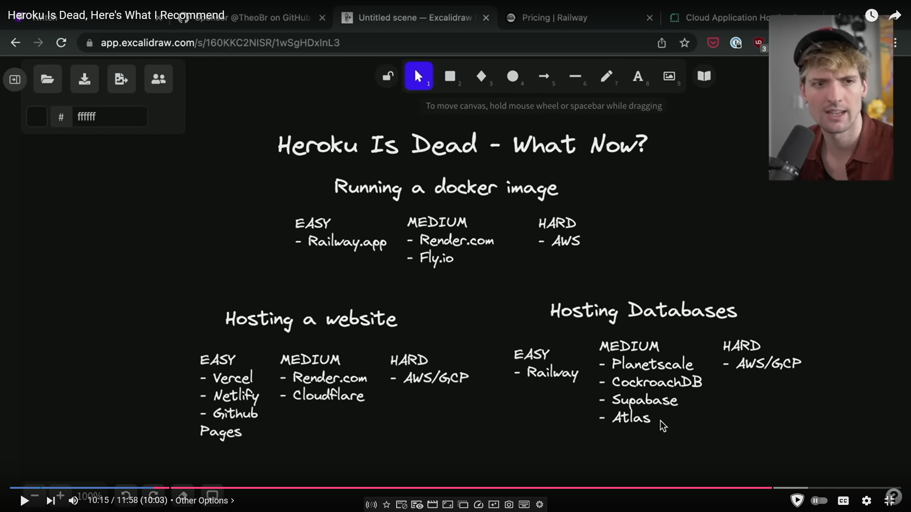

# Deployment

> Was Heroku (free tier) good for this? 😢

What I've used so far

- GitHub Pages
- Firebase
- Repl.it?

## Might-be-useful sources

### Theo (https://www.youtube.com/watch?v=prjMJtXCR-g)

- Primary recommendation is **Railway**
  - Not free though...

### Fireship

- Really pushes for **Firebase**
- Cloud Functions?
  - Still paid...

## Platform-as-a-Service

"Abstractions" (lol) over cloud providers, e.g. AWS, GCP, MS Azure

### Railway

- Seems nice
- "Flash and forget" solution

### Fly

- Seems like Railway
- A bit more complicated?

### Render

- Ultimately ended up with this one
- Pulls from Git repo and runs build
- [Node version can be set via an environment variable](https://render.com/docs/node-version)
- Other environment variables can also be set on UI
